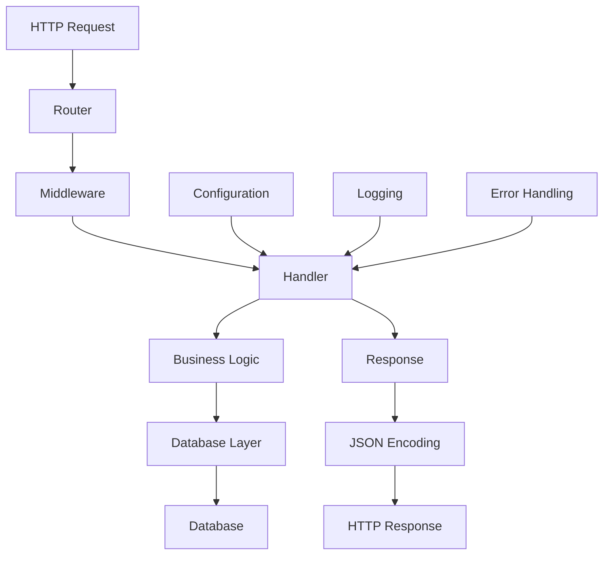

# Go API Development Tutorial

A comprehensive guide to building a Go application with an API that interacts with a database.

## Project Structure and Setup

Start by organizing your project with a clean directory structure. The standard Go project layout typically includes directories for `cmd` (main applications), `internal` (private application code), `pkg` (public library code), and `api` (API definitions). Initialize your project with [Go modules](https://go.dev/doc/modules/managing-dependencies) using `go mod init` to manage dependencies.

### Recommended Project Structure

```
my-api-project/
├── cmd/
│   └── api/
│       └── main.go              # Application entry point
├── internal/
│   ├── handlers/
│   │   ├── user.go              # User-related HTTP handlers
│   │   ├── product.go           # Product-related HTTP handlers
│   │   └── middleware.go        # Custom middleware
│   ├── models/
│   │   ├── user.go              # User data structures
│   │   └── product.go           # Product data structures
│   ├── database/
│   │   ├── connection.go        # Database connection setup
│   │   ├── migrations/          # SQL migration files
│   │   └── queries/             # SQL query files
│   └── config/
│       └── config.go            # Configuration management
├── pkg/
│   └── utils/
│       └── validation.go        # Reusable utility functions
├── api/
│   └── openapi.yaml             # API specification
├── docker-compose.yml           # Local development setup
├── Dockerfile                   # Container configuration
├── go.mod                       # Go module definition
├── go.sum                       # Dependency checksums
└── README.md                    # Project documentation
```

### Application Architecture Flow



## Database Layer

Choose your database driver based on your database system. For PostgreSQL, `lib/pq` or the newer `pgx` are popular choices. MySQL users typically use `go-sql-driver/mysql`. The standard [`database/sql`](https://pkg.go.dev/database/sql) package provides the interface for SQL databases, while `sqlx` is a popular extension that adds helpful features like struct scanning.

For database migrations, tools like `golang-migrate/migrate` help manage schema changes. Consider using a query builder like `squirrel` or an ORM like `gorm` if you prefer higher-level abstractions, though many Go developers favor writing raw SQL for better control and performance.

### Database Package Structure Example

```
internal/database/
├── connection.go           # Database connection and pool setup
├── models/
│   ├── user.go            # User model and SQL operations
│   ├── product.go         # Product model and SQL operations
│   └── base.go            # Common database operations
├── migrations/
│   ├── 001_create_users.up.sql
│   ├── 001_create_users.down.sql
│   ├── 002_create_products.up.sql
│   └── 002_create_products.down.sql
└── queries/
    ├── users.sql          # Complex user queries
    └── products.sql       # Complex product queries
```

## HTTP Server and Routing

The standard [`net/http`](https://pkg.go.dev/net/http) package provides basic HTTP server functionality, but most applications benefit from a router. Popular choices include `gorilla/mux` for its simplicity, `chi` for its lightweight design, or `gin` for higher performance and built-in features like JSON binding and validation.

Structure your handlers using dependency injection patterns. Create a handler struct that holds your database connection and other dependencies, then define methods on this struct for each endpoint.

### Handler Package Structure Example

```
internal/handlers/
├── handler.go              # Base handler struct with dependencies
├── users.go               # User-related endpoints
│   ├── GetUser()
│   ├── CreateUser()
│   ├── UpdateUser()
│   └── DeleteUser()
├── products.go            # Product-related endpoints
├── auth.go                # Authentication endpoints
└── middleware/
    ├── auth.go            # Authentication middleware
    ├── logging.go         # Request logging middleware
    ├── cors.go            # CORS middleware
    └── ratelimit.go       # Rate limiting middleware
```

### Request Flow Diagram

```mermaid
graph LR
    A[Client Request] --> B[CORS Middleware]
    B --> C[Logging Middleware]
    C --> D[Auth Middleware]
    D --> E[Rate Limit Middleware]
    E --> F[Route Handler]
    F --> G[Business Logic]
    G --> H[Database Query]
    H --> I[Response Formation]
    I --> J[JSON Response]
```



## API Design Patterns

Follow RESTful principles for your API design. Implement proper HTTP status codes, use JSON for request/response bodies, and structure your URLs logically. The standard [`encoding/json`](https://pkg.go.dev/encoding/json) package handles JSON marshaling and unmarshaling.

Consider implementing middleware for cross-cutting concerns like logging, authentication, CORS, and request validation. Most routers support middleware chains that execute before your handlers.

## Configuration Management

Use environment variables for configuration, especially for sensitive data like database credentials. The `os` package provides access to environment variables, while libraries like `viper` offer more sophisticated configuration management with support for multiple formats.

## Database Connection Management

Implement proper connection pooling using the database/sql package's built-in pool. Configure appropriate connection limits, timeouts, and retry logic. Use context for request-scoped operations and to handle cancellation properly.

## Error Handling

Develop a consistent error handling strategy. Create custom error types for different scenarios, implement proper error logging, and return appropriate HTTP status codes. Consider using structured logging with packages like `logrus` or `zap`.

## Testing Strategy

Write unit tests for your handlers and database operations. Use the `testing` package for basic tests, and consider `testify` for assertions and mocking. Implement integration tests that use a test database, and consider using Docker for consistent test environments.

## Security Considerations

Implement input validation and sanitization, use parameterized queries to prevent SQL injection, add rate limiting, and implement proper authentication and authorization. Consider using JWT tokens for stateless authentication.

## Deployment Preparation

Structure your application with health check endpoints, implement graceful shutdown handling, add metrics collection, and use structured logging. Consider containerizing your application with Docker for consistent deployments.

## Development Workflow

Set up proper dependency management, use tools like `golangci-lint` for code quality, implement hot reloading during development with tools like `air`, and establish a clear build process.

## Best Practices Summary

- Follow the standard Go project layout
- Use dependency injection for handlers
- Implement proper error handling and logging
- Write comprehensive tests
- Use environment variables for configuration
- Implement security measures from the start
- Plan for deployment and monitoring

This approach will give you a solid foundation for a production-ready Go API application. Each step builds upon the previous ones, creating a maintainable and scalable codebase that follows Go community best practices.

---

## Appendix: Go for Java Developers

A guide to help Java developers understand Go's approach to object-oriented concepts and key differences.

### Interfaces: Implicit vs Explicit

**Java (Explicit Implementation)**
```java
// Interface definition
interface Drawable {
    void draw();
}

// Explicit implementation
class Circle implements Drawable {
    public void draw() {
        System.out.println("Drawing a circle");
    }
}
```

**Go (Implicit Implementation)**
```go
// Interface definition
type Drawable interface {
    Draw()
}

// Implicit implementation - no "implements" keyword needed
type Circle struct {
    radius float64
}

func (c Circle) Draw() {
    fmt.Println("Drawing a circle")
}
// Circle automatically satisfies Drawable interface
```

### Inheritance vs Composition

**Java (Class Inheritance)**
```java
// Base class
class Animal {
    protected String name;
    
    public void speak() {
        System.out.println("Animal makes a sound");
    }
}

// Inheritance
class Dog extends Animal {
    @Override
    public void speak() {
        System.out.println("Dog barks");
    }
}
```

**Go (Struct Embedding)**
```go
// Base struct
type Animal struct {
    Name string
}

func (a Animal) Speak() {
    fmt.Println("Animal makes a sound")
}

// Composition via embedding
type Dog struct {
    Animal  // Embedded struct
    Breed string
}

// Method overriding through redefinition
func (d Dog) Speak() {
    fmt.Println("Dog barks")
}
```

### Polymorphism Comparison

**Java (Interface-based Polymorphism)**
```java
List<Drawable> shapes = new ArrayList<>();
shapes.add(new Circle());
shapes.add(new Rectangle());

for (Drawable shape : shapes) {
    shape.draw();  // Polymorphic call
}
```

**Go (Interface-based Polymorphism)**
```go
var shapes []Drawable
shapes = append(shapes, Circle{radius: 5})
shapes = append(shapes, Rectangle{width: 10, height: 5})

for _, shape := range shapes {
    shape.Draw()  // Polymorphic call
}
```

### Access Modifiers vs Visibility

**Java (Explicit Access Modifiers)**
```java
public class User {
    private String id;        // Private
    protected String name;    // Protected
    public String email;      // Public
    
    public String getId() {   // Public getter
        return id;
    }
}
```

**Go (Case-based Visibility)**
```go
type User struct {
    id    string  // private (lowercase)
    Name  string  // public (uppercase)  
    Email string  // public (uppercase)
}

// Public method (uppercase)
func (u User) GetID() string {
    return u.id
}

// private method (lowercase)
func (u User) validateEmail() bool {
    // validation logic
}
```

### Error Handling Differences

**Java (Exception-based)**
```java
public User getUserById(String id) throws UserNotFoundException {
    User user = database.findUser(id);
    if (user == null) {
        throw new UserNotFoundException("User not found: " + id);
    }
    return user;
}

// Usage with try-catch
try {
    User user = getUserById("123");
    // process user
} catch (UserNotFoundException e) {
    // handle error
}
```

**Go (Error Values)**
```go
func GetUserByID(id string) (User, error) {
    user, err := database.FindUser(id)
    if err != nil {
        return User{}, fmt.Errorf("user not found: %s", id)
    }
    return user, nil
}

// Usage with explicit error checking
user, err := GetUserByID("123")
if err != nil {
    // handle error
    return err
}
// process user
```

### Package Organization

**Java (Package Declaration)**
```java
package com.company.project.service;

import com.company.project.model.User;
import java.util.List;

public class UserService {
    // class implementation
}
```

**Go (Package Declaration)**
```go
package service

import (
    "fmt"
    "github.com/company/project/internal/models"
)

type UserService struct {
    // struct fields
}
```

### Constructor Patterns

**Java (Constructors)**
```java
public class User {
    private String name;
    private String email;
    
    // Default constructor
    public User() {}
    
    // Parameterized constructor
    public User(String name, String email) {
        this.name = name;
        this.email = email;
    }
}
```

**Go (Constructor Functions)**
```go
type User struct {
    Name  string
    Email string
}

// Constructor function (convention: New + TypeName)
func NewUser(name, email string) *User {
    return &User{
        Name:  name,
        Email: email,
    }
}

// Factory function with validation
func NewUserWithValidation(name, email string) (*User, error) {
    if name == "" {
        return nil, fmt.Errorf("name cannot be empty")
    }
    if !isValidEmail(email) {
        return nil, fmt.Errorf("invalid email format")
    }
    return &User{Name: name, Email: email}, nil
}
```

### Interface Composition vs Multiple Inheritance

**Java (Multiple Interface Implementation)**
```java
interface Reader {
    String read();
}

interface Writer {
    void write(String data);
}

class FileHandler implements Reader, Writer {
    public String read() { /* implementation */ }
    public void write(String data) { /* implementation */ }
}
```

**Go (Interface Embedding)**
```go
type Reader interface {
    Read() string
}

type Writer interface {
    Write(data string)
}

// Interface composition
type ReadWriter interface {
    Reader
    Writer
}

type FileHandler struct{}

func (f FileHandler) Read() string { /* implementation */ }
func (f FileHandler) Write(data string) { /* implementation */ }
// FileHandler automatically implements ReadWriter
```

### Key Mindset Shifts for Java Developers

1. **No Classes**: Think in terms of structs and functions, not classes and methods
2. **Composition Over Inheritance**: Use embedding and interfaces instead of class hierarchies
3. **Implicit Interfaces**: Focus on behavior contracts rather than explicit implementations
4. **Error Values**: Handle errors explicitly as return values, not exceptions
5. **Simplicity**: Go favors simple, explicit code over complex abstractions
6. **Package-level Functions**: Not everything needs to be a method on a struct
7. **Pointers**: Understand when to use value vs pointer receivers

This paradigm shift from Java's object-oriented approach to Go's more functional and composition-based style often results in simpler, more maintainable code once you adapt to the Go way of thinking.
