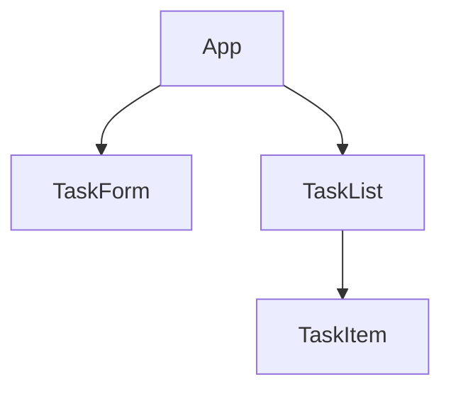

Below is a comprehensive markdown document for your React + TypeScript CRUD tutorial, including explanations, Java comparisons, mindset shifts, Mermaid diagrams, stubbing/mocking strategies, state management advice, and an appendix on React frameworks.

# React + TypeScript CRUD Application Tutorial  
*For Java Developers*

## 1. Project Setup

**Explanation**  
Start a new project using Vite (recommended for lightweight setups) or Create React App. Both support TypeScript out of the box.

**Command Examples**

```bash
# Vite
npm create vite@latest task-manager -- --template react-ts
cd task-manager
npm install

# Create React App
npx create-react-app task-manager --template typescript
cd task-manager
```

**Comparison to Java**  
Unlike Java projects (where you use Gradle or Maven for builds and Spring Boot for server apps), React projects are client-side, focusing on UI and API integration[1].

**Mindset Shift**  
You are building a single-page application (SPA), not a server-rendered app. State and logic live in the browser, not on the server.

**Official Documentation**  
- [Create React App with TypeScript](https://create-react-app.dev/docs/adding-typescript/)
- [Vite with React and TypeScript](https://vitejs.dev/guide/)

## 2. Project Structure

**Directory Layout**

```
src/
├── api/
│   └── taskService.ts
├── components/
│   ├── TaskList.tsx
│   ├── TaskForm.tsx
│   └── TaskItem.tsx
├── models/
│   └── Task.ts
├── App.tsx
└── App.test.tsx
```

**Comparison to Java**  
- **`models/`**: Like Java POJOs, but just interfaces for type safety.
- **`api/`**: Similar to service or DAO layers, but for REST calls.
- **`components/`**: Reusable UI widgets, analogous to custom JSP tags but more powerful.

**Mindset Shift**  
Think in terms of composable, reusable components, not server-rendered pages.

## 3. Data Model

**src/models/Task.ts**

```typescript
export interface Task {
  id: string;
  title: string;
  description: string;
  status: 'pending' | 'in-progress' | 'completed';
}
```

**Comparison to Java**  
This is like a Java class but without methods. TypeScript interfaces are for type checking, not runtime behavior.

## 4. API Service Layer

**src/api/taskService.ts**

```typescript
const BASE_URL = 'https://your-backend-service/api/tasks';

export const createTask = async (task: Omit) => {
  const response = await fetch(BASE_URL, {
    method: 'POST',
    headers: { 'Content-Type': 'application/json' },
    body: JSON.stringify(task),
  });
  return response.json();
};

// ...other CRUD methods
```

**Comparison to Java**  
This is similar to a Java service or DAO, but uses asynchronous REST calls.

**Mindset Shift**  
You handle Promises and async/await, not blocking calls.

## 5. Component Architecture



**Explanation**  
React apps are built as a tree of components. Parent components pass data to children via props.

**Comparison to Java**  
In Java, you might use JSP includes or Thymeleaf fragments. Here, components are more flexible and stateful.

## 6. State Management

**Handling State Between Pages**

React SPAs don’t have traditional "pages" but rather views rendered by components. State can be managed in parent components and passed down as props. For more complex state, use React Context or a state management library like Redux.

**When to Use Redux (or Similar)**

- **Shared State:** When multiple components need access to the same state.
- **Complex State Logic:** When state updates are complex or involve side effects.
- **Large Applications:** When the app grows and state becomes hard to manage with just props and context.

**Comparison to Java**  
In Java, state is often managed in the session or request scope. In React, it’s managed in the client, either locally or globally.

## 7. Testing: Stubbing and Mocking

**Approaches**

- **Stubbing:** Replace real API calls with simple, controlled responses in tests.
- **Mocking:** Use Jest’s mocking capabilities to replace entire modules or functions.

**Example: Mocking an API Call**

```typescript
// In your test file
jest.mock('../api/taskService', () => ({
  searchAllTasks: jest.fn().mockResolvedValue([
    { id: '1', title: 'Test Task', description: 'Test Description', status: 'pending' }
  ])
}));
```

**Comparison to Java**  
In Java, you might use Mockito for mocking. In React, Jest provides similar functionality.

## 8. Best Practices

- **Type Safety:** Use TypeScript for compile-time checks, similar to Java’s strong typing[2].
- **Separation of Concerns:** Keep API logic in services, UI in components.
- **Testing:** Use React Testing Library for integration-style tests, not just unit tests.
- **Error Handling:** Add error handling for API calls.
- **Component Reusability:** Build small, focused components.

## 9. Testing Setup

**Install Dependencies**

```bash
npm install --save-dev jest @testing-library/react @testing-library/jest-dom @types/jest
```

**Configure Jest**

```typescript
// jest.config.ts
export default {
  preset: 'ts-jest',
  testEnvironment: 'jsdom',
  setupFilesAfterEnv: ['/jest.setup.ts'],
};
```

**Example Test**

```typescript
import { render, screen } from '@testing-library/react';
import App from './App';

test('renders task manager title', () => {
  render();
  expect(screen.getByText('Task Manager')).toBeInTheDocument();
});
```

**Official Documentation**  
- [React Testing Library](https://testing-library.com/docs/react-testing-library/intro/)
- [Jest](https://jestjs.io/docs/getting-started)

## 10. Mindset Shifts

- **From Imperative to Declarative:** Declare what you want the UI to look like, not how to change it.
- **From Server-Side to Client-Side:** Logic and state are managed in the browser.
- **From Synchronous to Asynchronous:** Most API calls are async.
- **From Monolithic to Component-Based:** Build UIs from small, reusable components.

## 11. Comparison Table

| Aspect                | Java (Spring/JSP)                | React + TypeScript (SPA)         |
|-----------------------|----------------------------------|----------------------------------|
| Project Structure     | Server-side MVC                  | Client-side component-based      |
| Data Fetching         | Controllers/DAO                  | Services/API calls               |
| UI Rendering          | Server-side (JSP/Thymeleaf)      | Client-side (React components)   |
| State Management      | Server session/request           | Client state/hooks               |
| Type Safety           | Java compiler                    | TypeScript compiler              |
| Testing               | JUnit (server logic)             | Jest/Testing Library (UI logic)  |

## 12. Appendix: React Frameworks and Libraries

| Framework/Library | Pros                                                | Cons                                      |
|-------------------|-----------------------------------------------------|-------------------------------------------|
| **React**         | Lightweight, flexible, large ecosystem              | State management can get complex          |
| **Next.js**       | SSR, SSG, API routes, great for SEO                 | Heavier, more opinionated                 |
| **Gatsby**        | Great for static sites, fast performance            | Not ideal for highly dynamic apps         |
| **Remix**         | Modern, full-stack, great developer experience      | Newer, smaller community                  |
| **Redux**         | Predictable state management, dev tools             | Boilerplate, overkill for small apps      |
| **MobX**          | Simpler than Redux, reactive state                  | Less predictable, smaller ecosystem       |
| **React Query**   | Excellent for data fetching, caching, mutations     | Focused on data, not general state        |

## 13. Additional Resources

- **React:** [Official React Docs](https://react.dev/)
- **TypeScript:** [Official TypeScript Docs](https://www.typescriptlang.org/)
- **Create React App:** [Create React App Docs](https://create-react-app.dev/)
- **Vite:** [Vite Docs](https://vitejs.dev/)
- **React Testing Library:** [React Testing Library Docs](https://testing-library.com/docs/react-testing-library/intro/)
- **Jest:** [Jest Docs](https://jestjs.io/docs/getting-started)

## 14. Summary

This tutorial guides you through building a modern, type-safe React application with TypeScript, highlighting key differences from Java development. It covers project setup, component architecture, state management, testing, and best practices, along with a comparison of React frameworks and libraries.

[1] programming.build_tools
[2] programming.api_development
